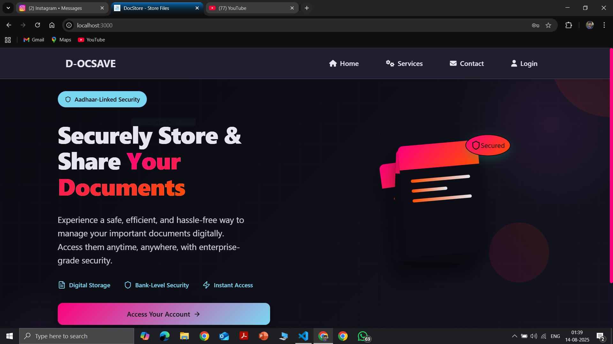
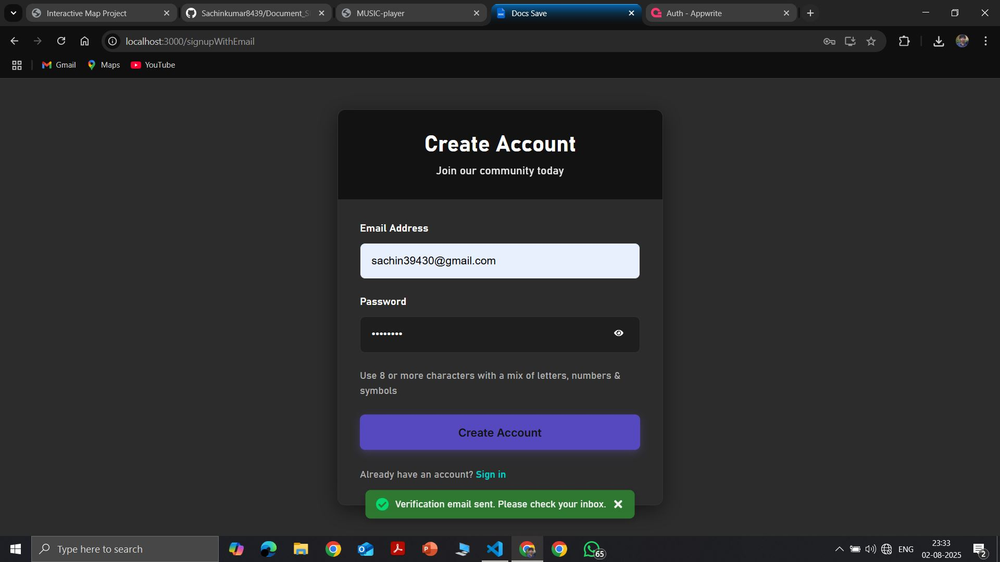
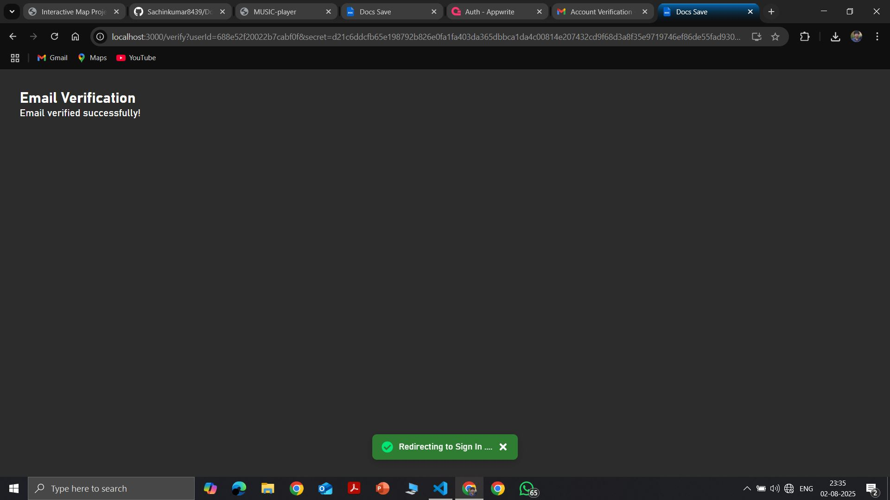
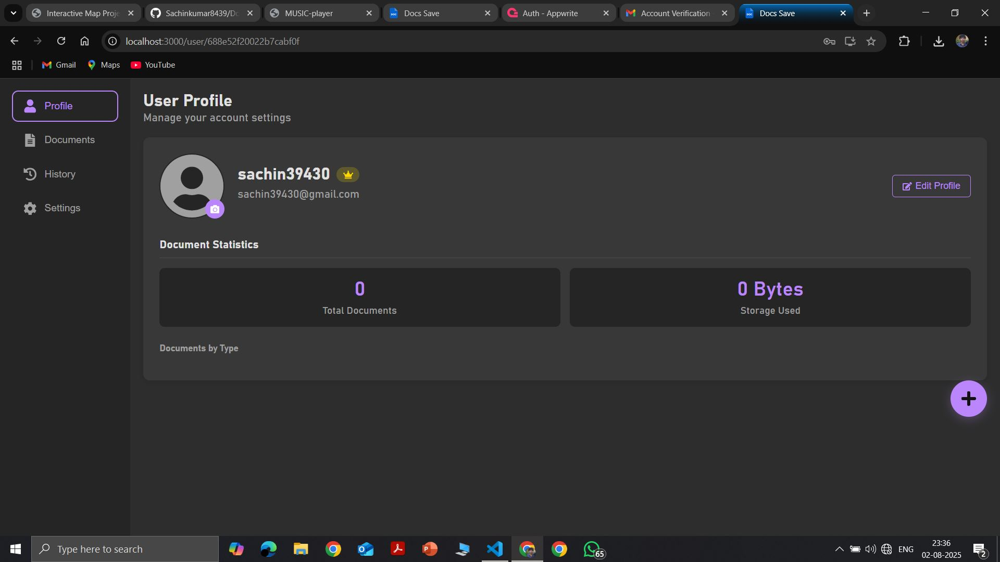
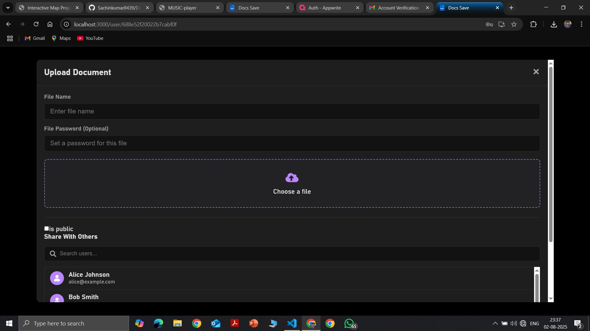
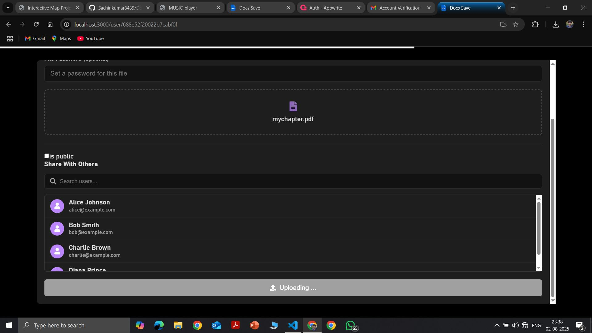
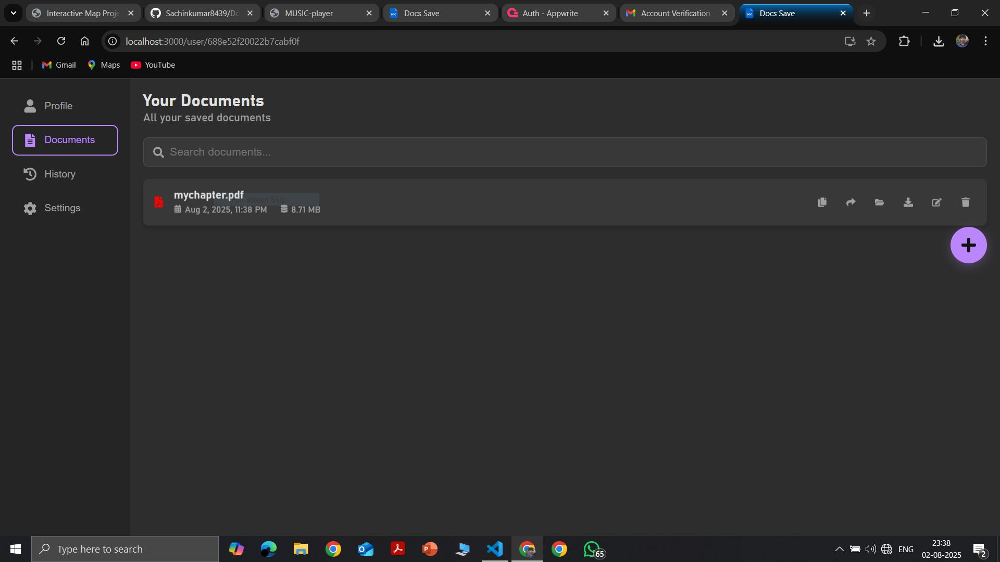
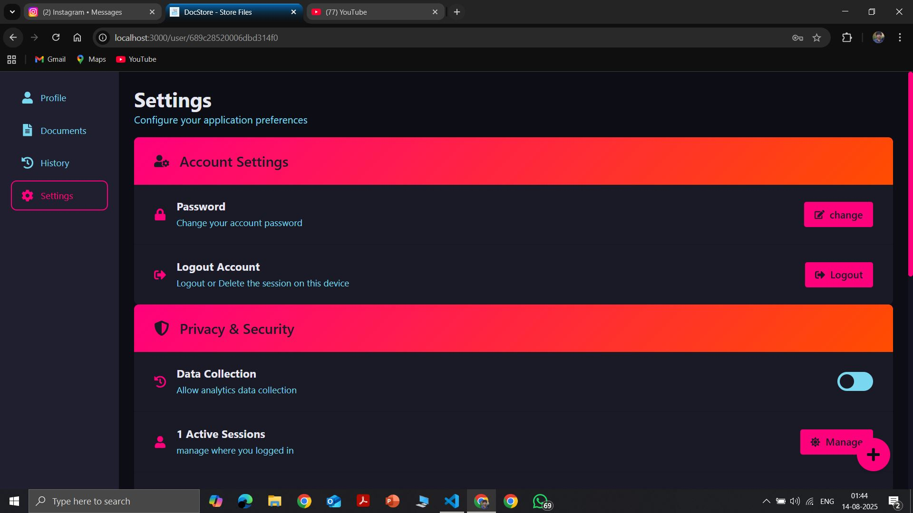

# Document Sharing Web Application










A secure, responsive document sharing platform with user authentication, file management, and sharing capabilities. Built with React.js and Appwrite backend.

## Features

### Authentication System
- ✅ Email verification for new users
- ✅ Secure login/logout functionality
- ✅ Password reset via email
- ✅ Password change (with old password verification)
- ✅ Account deletion option

### Profile Management
- ✏️ Update user name
- 🖼️ Change profile picture
- 🔒 Secure profile updates

### File Management
- 📤 Upload files (multiple formats supported)
- 📥 Download files
- ✏️ Edit file metadata (name, security or permissions)
- 🗑️ Delete files
- ⏱️ File upload timestamps
- 📏 File size tracking
- 📊 Storage quota monitoring

### Sharing & Security
- 🔗 Share files with other users
- 🌐 Public/Private file visibility options
- 🔒 Secure handling of sensitive documents
- 👥 Permission management for shared files

### Activity Tracking
- 📜 Complete action history log
- 🔍 Filterable activity timeline
- ⏰ Timestamped operations

### Technical Specifications
- ⚛️ Built with React.js
- 🛣️ React Router for navigation
- 🏗️ Context API for state management
- 🔙 Appwrite backend service
- 💅 Modern CSS styling
- 📱 Fully responsive design

## Supported File Types

| Category       | Extensions                          |
|----------------|-------------------------------------|
| Images         | .jpg, .jpeg, .png, .gif,            |
| Documents      | .pdf, .doc, .docx, .txt,            |
| Presentations  | .ppt, .pptx                         |
| Audio          | .mp3,                               |
| Video          | .mp4,                               |
| Code           | .html, .css .json,                  |

## Installation

1. Clone the repository:
   ```bash
   git clone https://github.com/Sachinkumar8439/Document_Sharing_web.git
   ```
2. go to project directory
    ```bash
    cd Document_Sharing_web
    ```
3. install packages
    ```bash
    npm install
    ```
4. start the development server
    ```bash
    npm start
    ```

## 📬 Contact

For any inquiries or issues, feel free to reach out at **[sachin39430@gmail.com](mailto:sachin39430@gmail.com)**.
